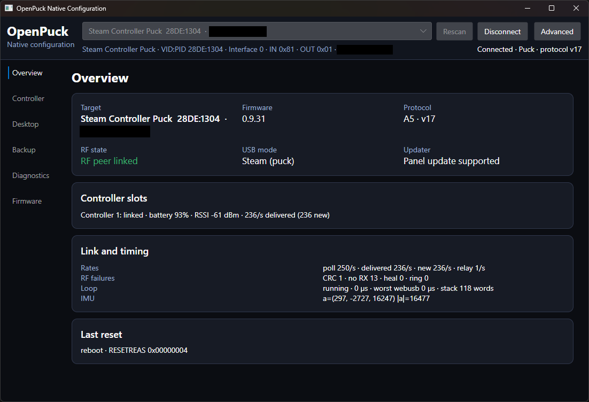

# OpenPuck Native Configuration

A cross-platform native desktop application for discovering, configuring, diagnosing, backing up, and updating OpenPuck microcontroller targets.

The application is written in C# with Avalonia and communicates directly over USB through libusb. It does not require a browser and does not embed HTML, a WebView, or a browser engine.

> [!IMPORTANT]
> This is an independent native client for OpenPuck hardware. The upstream firmware and original browser configuration interface are maintained by the [OpenPuck project](https://github.com/safijari/openpuck/tree/main). This repository does not replace or represent the upstream project.

> [!IMPORTANT]
> Linux and MacOS is currently untested!

[]

## Features

- Native Windows, Linux, and macOS UI.
- Automatic discovery of OpenPuck puck and ReversePuck targets.
- One actively claimed target at a time with target switching and reconnect support.
- Live status updates approximately every 600 ms.
- Overview of firmware, protocol, USB mode, RF links, controller slots, battery, signal, rates, failures, timing, reset state, and IMU data.
- Staged controller settings with **Apply** and **Revert**.
- USB modes, back-button chords, mouse, rumble, Switch motion, and per-emulated-controller mappings.
- Protocol-v16 desktop/lizard-map editor.
- Web-interface-compatible settings and four-bond JSON backup/restore.
- Capture, flight-recorder, wedge, reset, timing, and maintenance diagnostics.
- Local UF2 and GitHub-release firmware updates with UF2 validation, CRC32, on-device verification, transfer resynchronization, and automatic post-flash reconnect.
- Connected-device DFU reboot commands plus a standalone 1200-baud serial-touch bootloader trigger that does not flash firmware.
- In-app version display, stable/prerelease-aware update checks, and links to this application and the upstream OpenPuck project.
- Session-only Advanced mode with an explicit warning for prereleases, engineering diagnostics, factory erase, and full-board wipe.

## Project status

The attached `28DE:1304` OpenPuck target has been verified on Windows with an A5 protocol-v17 handshake. Automated tests cover protocol parsing, USB cleanup, reconnect behavior, settings fields, backup compatibility, lizard maps, UF2 extraction, and CRC32.

Hardware acceptance is still required for:

- ReversePuck-specific operations.
- Linux and macOS USB access and packaging.
- Firmware flashing and destructive maintenance operations on expendable hardware.

## Installation

Download the archive for your operating system and CPU architecture from the [GitHub Releases page](https://github.com/kevinf100/OpenPuckWeblessSettings/releases). Each archive contains a single self-contained executable, so release builds do not require a separate .NET installation or adjacent dependency files. A compatible OpenPuck microcontroller target exposing its vendor-class bulk USB interface is also required.

### Windows

1. Download the `win-x64.zip` archive for a typical Intel or AMD Windows PC, or `win-arm64.zip` for Windows on ARM.
2. Extract the executable from the archive to a folder. Do not run it from inside the ZIP file.
3. Run `OpenPuckWeblessSettings.exe`.

The required libusb 1.0.30 native library is bundled inside the executable and extracted automatically when the app starts. Windows should automatically load its built-in WinUSB driver when the OpenPuck is connected. If the app cannot find the device, open Device Manager and verify that the OpenPuck vendor interface uses **WinUSB**. If necessary, follow Microsoft's [WinUSB installation guidance](https://learn.microsoft.com/en-us/windows-hardware/drivers/usbcon/automatic-installation-of-winusb) for the vendor interface.

### Linux

Linux archives are published for x64 and ARM64 systems. Download the `linux-x64.tar.gz` archive for an Intel or AMD system, or the `linux-arm64.tar.gz` archive for an ARM64 system. Extract the selected archive and make the application executable:

```bash
tar -xzf OpenPuckWeblessSettings-*-linux-x64.tar.gz
chmod +x OpenPuckWeblessSettings
./OpenPuckWeblessSettings
```

Install the libusb 1.0 runtime for your distribution:

```bash
# Debian or Ubuntu
sudo apt update
sudo apt install libusb-1.0-0

# Fedora or RHEL
sudo dnf install libusb1

# Arch Linux
sudo pacman -S libusb
```

USB access also requires the included [`50-openpuck.rules`](packaging/linux/50-openpuck.rules) udev rule. Download that file, change to the directory containing it, and run:

```bash
sudo groupadd --force plugdev
sudo usermod -aG plugdev "$USER"
sudo install -Dm644 50-openpuck.rules /etc/udev/rules.d/50-openpuck.rules
sudo udevadm control --reload-rules
sudo udevadm trigger --subsystem-match=usb
```

Sign out and back in so the new group membership takes effect, then unplug and reconnect the OpenPuck before starting the app.

### macOS

1. Download `osx-arm64.tar.gz` for an Apple Silicon Mac or `osx-x64.tar.gz` for an Intel Mac.
2. Install [Homebrew](https://brew.sh/) if needed, then install the native libusb library:

   ```bash
   brew install libusb
   ```

3. Extract the archive and launch the application:

   ```bash
   tar -xzf OpenPuckWeblessSettings-*-osx-*.tar.gz
   chmod +x OpenPuckWeblessSettings
   ./OpenPuckWeblessSettings
   ```

The application archive and the Homebrew libusb installation must match the Mac's architecture. If the app reports that the native libusb library was not found, launch it with Homebrew's library directory available:

```bash
DYLD_LIBRARY_PATH="$(brew --prefix libusb)/lib" ./OpenPuckWeblessSettings
```

The macOS archives are currently unsigned and not notarized. If macOS blocks the first launch and you trust the downloaded archive, try to open it once, then go to **System Settings > Privacy & Security** and choose **Open Anyway** as described in [Apple's guidance for unsigned apps](https://support.apple.com/en-us/102445).

On every platform, close Steam, browsers, USB sniffers, and other applications that might already own the OpenPuck USB interface before connecting.

## Build and run

Building from source requires the [.NET 10 SDK](https://dotnet.microsoft.com/download). The SDK is not required when using a release archive.

```powershell
dotnet restore OpenPuckWeblessSettings.slnx
dotnet run --project OpenPuckWeblessSettings.csproj
```

The app scans automatically. Select an OpenPuck target and choose **Connect**.

The **About** tab shows the installed app version and checks this repository's GitHub releases for updates. Update checks only notify and open the matching release page; the app does not download or replace itself.

For a terminal-only connection check:

```powershell
dotnet run --project OpenPuckWeblessSettings.csproj -- --probe
```

## Tests

```powershell
dotnet test OpenPuckWeblessSettings.slnx
```

## Entering DFU without flashing

The Firmware tab offers two separate paths:

- **Connected OpenPuck bootloaders** sends the existing Serial DFU or UF2 DFU reboot command to a connected OpenPuck. These buttons do not select, transfer, or flash an image.
- **Unflashed board / serial bootloader** enumerates host serial ports and sends a 1200-baud touch to the selected port. This works only when the board's current CDC application or bootloader supports that convention.

If the board exposes no serial port or does not respond, double-tap its Reset button or briefly short RST to GND twice. Hardware behavior varies by bootloader; confirm the correct reset procedure for your board before proceeding.

## Downloads and publishing

Stable and prerelease builds are published on this repository's [GitHub Releases page](https://github.com/kevinf100/OpenPuckWeblessSettings/releases). Release archives and their platform requirements are described in the [Installation](#installation) section.

For maintainers, pushing a semantic tag such as `v0.2.0` automatically tests, builds, and creates a stable release. A suffix such as `v0.2.0-rc.1` creates a GitHub prerelease. The Release workflow can also be started manually with a version and stable/prerelease selection; it refuses to replace an existing tag or release.

## Local publishing

Self-contained builds do not require a separately installed .NET runtime:

```powershell
dotnet publish OpenPuckWeblessSettings.csproj -c Release -r win-x64 --self-contained true
dotnet publish OpenPuckWeblessSettings.csproj -c Release -r win-arm64 --self-contained true
dotnet publish OpenPuckWeblessSettings.csproj -c Release -r linux-x64 --self-contained true
dotnet publish OpenPuckWeblessSettings.csproj -c Release -r linux-arm64 --self-contained true
dotnet publish OpenPuckWeblessSettings.csproj -c Release -r osx-x64 --self-contained true
dotnet publish OpenPuckWeblessSettings.csproj -c Release -r osx-arm64 --self-contained true
```

Linux and macOS distributions use the system's compatible native libusb library. Platform archives should be tested and signed according to the target operating system's requirements before being redistributed as trusted packages.

## Advanced mode and safety

Advanced mode exposes operations that can erase settings, controller bonds, or the firmware itself. Firmware updates, factory-reset images, DFU commands, factory erase, and full-board wipe can disconnect the target or require manual UF2 recovery.

- Back up settings and bonds before maintenance.
- Do not unplug a target while an update is being verified or applied.
- Test firmware updates and destructive commands on hardware whose configuration can be lost.
- Full-board wipe intentionally removes the application firmware and requires a valid UF2 image for recovery.

The software is provided without any guarantee that it cannot corrupt configuration, interrupt input, or leave a target requiring manual recovery.

## Upstream credit

OpenPuck firmware, protocol behavior, hardware support, and the original web configuration interface come from the [safijari/openpuck project](https://github.com/safijari/openpuck/tree/main). The protocol implementation in this application was derived from the upstream project's current `index.html` and supporting documentation. Please report firmware-specific issues and contribute firmware improvements upstream where appropriate.

## AI usage disclosure

This application was developed with substantial assistance from OpenAI Codex, including code generation, refactoring, documentation, and test creation. Automated tests and an attached-hardware connection probe have been run, but AI-generated code can contain incorrect assumptions, incomplete edge-case handling, or security and reliability defects.

Users and contributors should review changes carefully and independently validate firmware updates, USB behavior, backup restoration, and destructive operations before relying on them. AI assistance does not imply endorsement, warranty, or support from OpenAI or the upstream OpenPuck project.

## Third-party software

- [Avalonia UI](https://avaloniaui.net/) — MIT licensed.
- [LibUsbDotNet](https://github.com/LibUsbDotNet/LibUsbDotNet) — LGPL-3.0-or-later.
- [libusb](https://libusb.info/) — LGPL-2.1-or-later.

See [`THIRD_PARTY_NOTICES.md`](THIRD_PARTY_NOTICES.md) for bundled native-library attribution. Preserve all applicable license notices when redistributing binaries.
